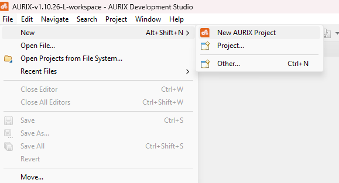
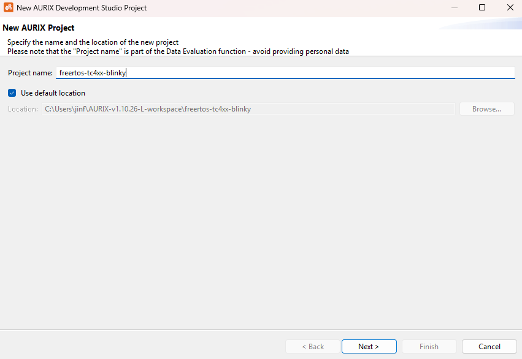
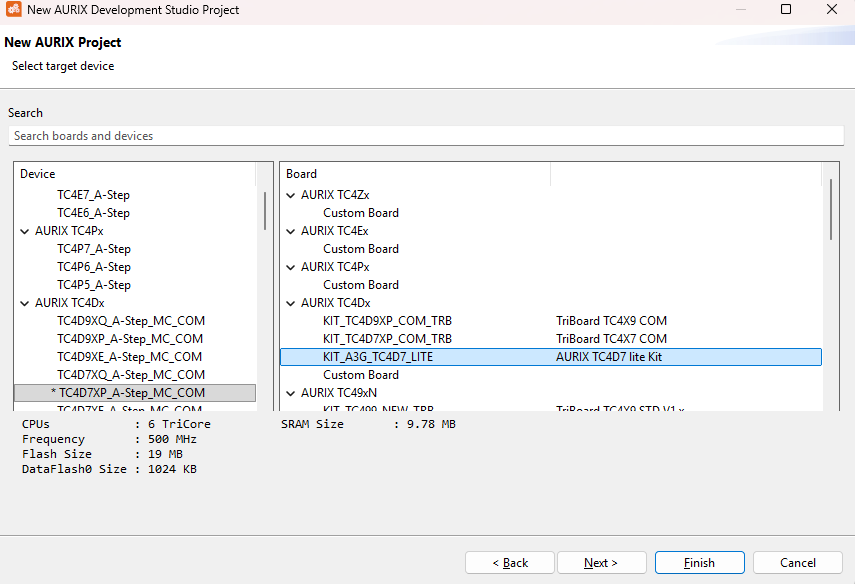
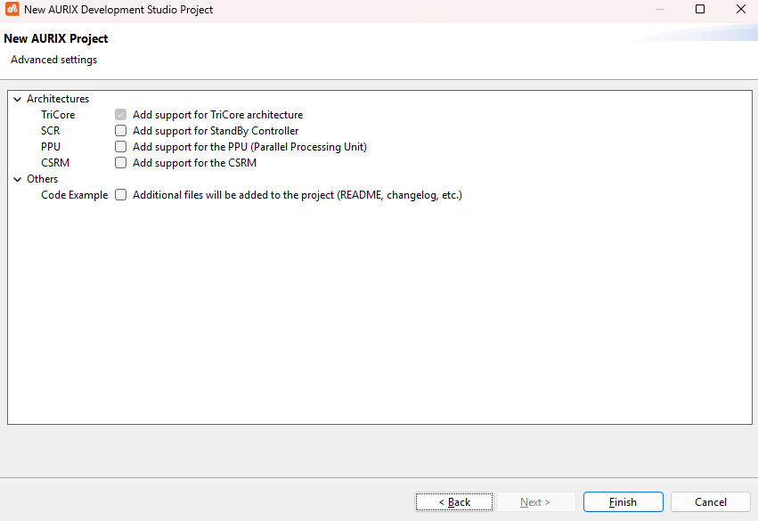
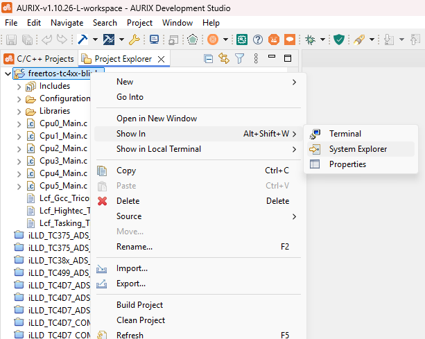
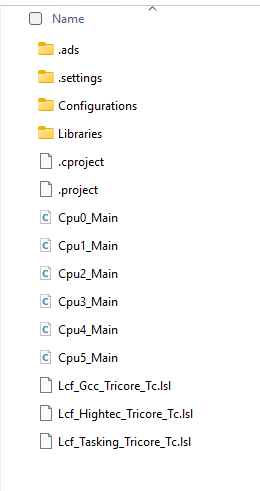
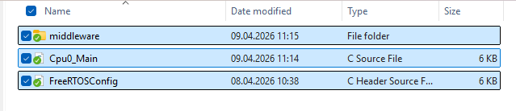
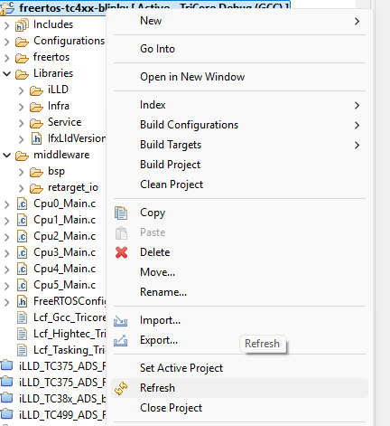
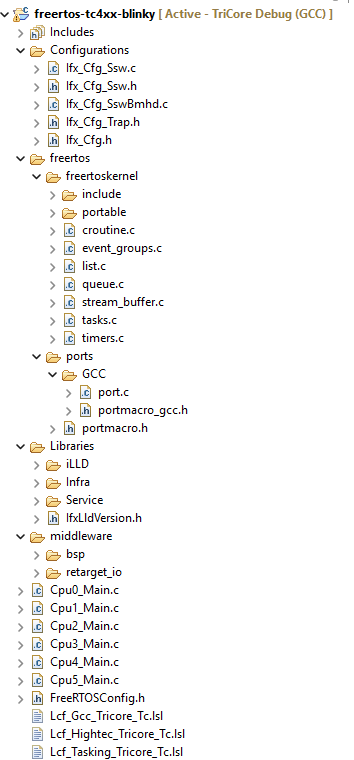
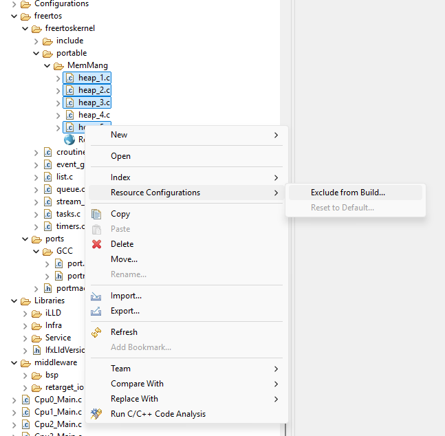

# FreeRTOS GCC Port for Infineon AURIX™ TC4xx Devices

## Getting Started with FreeRTOS on AURIX™ TC4xx

All the currently available examples/demos are based on the AURIX™ Development Studio limited(ADS-L), which includes a free built-in GCC compiler and debugger. The examples are built for the entry level [AURIX™ TC4D7 Lite Kit](https://www.infineon.com/evaluation-board/KIT-A3G-TC4D7-LITE) but should run on any TC4xx device/hardware with minor changes. All demos use the [Infineon Low Level Drivers (iLLDs)](https://www.infineon.com/cms/en/tools/aurix-embedded-sw/aurix-illd-drivers/), but a separate download is not required since they are included in ADS-L.

There are two demos available in this folder:

## Blinky

This project is a minimal FreeRTOS example for the AURIX&trade; TC4xx family using the GCC toolchain. It is intended to run on the AURIX&trade; KIT_A3G_TC4D7_LITE board and demonstrates that the startup software, board support package, FreeRTOS kernel, and TC4xx GCC port are integrated correctly.

After startup, CPU0 initializes the board resources, prints a banner through the debug UART, creates one FreeRTOS task, and starts the scheduler. That task toggles the on-board user LED periodically, so the project acts as a simple bring-up and port-validation example.

The main execution flow is:

1. CPU0 enters `core0_main()`.
2. Interrupts are enabled and the watchdogs used by the demo are disabled.
3. LED1 is configured as a push-pull output.
4. ASCLIN0 is initialized as the debug UART at 115200 baud.
5. A banner is printed over UART.
6. A single task named `LED_Task` is created.
7. `vTaskStartScheduler()` starts FreeRTOS scheduling on CPU0.

The LED task delays for 500 ms and then toggles the LED output. As a result, the LED changes state every 500 ms, corresponding to a full blink cycle of about 1 second.

## Egtm_Printf
In this example, one task blinks LED1 every 500 ms and toggles LED2 on each BUTTON1 press, while a second task blocks on `ulTaskNotifyTake(...)` and is notified once per second from an eGTM TOM periodic interrupt to print a status message over the debug UART.

The application entry point is implemented in `core0_main()` in `Cpu0_Main.c`. After disabling the watchdogs for demo purposes, the code initializes the board pins and the debug UART, creates two FreeRTOS tasks, configures an eGTM TOM timer, and starts the scheduler.  

Runtime behavior:

- `blinky_task` — Runs every 20 ms via `vTaskDelayUntil()`. Toggles LED1 every 500 ms. Polls BUTTON1 on each cycle and toggles LED2 on each new button press (rising-edge detection).

- `print_task` — Blocks on `ulTaskNotifyTake()`. When notified by the eGTM TOM ISR (once per second), prints a status message over the debug UART.

- `egtm_tom_timer_isr` — Acknowledges the TOM timer interrupt via `IfxEgtm_Tom_Timer_acknowledgeTimerIrq()` and wakes the print task using the ISR-safe FreeRTOS API (`vTaskNotifyGiveFromISR` + `portYIELD_FROM_ISR`).

## Board
The board used in this project is the AURIX KIT_A3G_TC4D7_LITE.

Hardware page:
- https://www.infineon.com/cms/en/product/evaluation-boards/kit_a3g_tc4d7_lite/

Board user guide:
- https://www.infineon.com/assets/row/public/documents/10/44/infineon-kit-a3g-tc4d7-lite-aurix-a3g-lite-kit-user-guide-usermanual-en.pdf

## Toolchain Setup
This project is based on AURIX Development Studio Limited (ADS-L). ADS-L is available only for a restricted set of users. To request access to ADS-L, send an email to `ads@infineon.com`. Alternatively, ADS-L can also be requested and installed using the Infineon Developer Center Launcher.

## Hardware Setup
- Connect the KIT_A3G_TC4D7_LITE board to the host PC
- The port pins used for LEDs and the BUTTON are defined using macros in the file `middleware/bsp/kit_tc4d7_lite.h`.
```c
#define BOARD_USER_LED_1       IfxPort_P03_9        /* Port/Pin for LED 1     */
#define BOARD_USER_LED_2       IfxPort_P03_10       /* Port/Pin for LED 2     */
#define BOARD_USER_BUTTON_1    IfxPort_P03_11       /* Port/Pin for BUTTION 1 */
```

- The project initializes the debug UART in `Cpu0_Main.c` using `retarget_io_init( &BOARD_DEBUG_UART_TX, &BOARD_DEBUG_UART_RX, 115200 )` in `middleware/retarget_io/include/retarget_io/retarget_io.h`

- The board debug UART pins are defined in `middleware/bsp/kit_tc4d7_lite.h` as:
```c
#define BOARD_DEBUG_UART_RX       IfxAsclin0_RXA_F_P14_1_IN
#define BOARD_DEBUG_UART_TX       IfxAsclin0_TX_F_P14_0_OUT
```

- Open a serial terminal on the COM port associated with the board or your debug connection.
- Use the following serial settings:
  - Baud rate: 115200
  - Data bits: 8
  - Stop bits: 1
  

## Creating an AURIX™ Development Studio limited Project

### 1. __File__ → __New__ → __New AURIX Project__, type in a name for the project and click "__Next__"

<br>


### 2. In the right column titled "__Board__", select the "__KIT_A3G_TC4D7_LITE__" and click "__Next__", in the popped-up window, click "__Finish__"

<br>


### 3. Go to the folder where the project was created and copy over the contents of any demo folder to the root of the project folder, e.g.
a. The project folder can be accessed as shown below...
<br>

<br>
b. Opening the project folder will show something like this...
<br>

<br>
c. Copy over the demo contents, for instance, the "__Blinky__" demo...
<br>


### 4. Add the FreeRTOS Kernel and the corresponding AURIX™ TC4xx portables in a folder called "__freertos__". The AURIX™ TC4xx FreeRTOS port used for these demos is available in the ___GCC/AURIX_TC4xx___ folder in the [___Partner Supported Ports___ repository](https://github.com/FreeRTOS/FreeRTOS-Kernel-Partner-Supported-Ports)

### 5. Copy all files from `/FreeRTOS-Partner-Supported-Demos/AURIX_TC4D7_ADS/Configurations` and overwrite the `/Configurations/` folder in the ADS-L project. Ensure `Ifx_Cfg_Trap.h` has the following lines, before placing it in the folder:

```c
extern int vPortSyscallHandler( unsigned char id );
#define IFX_CFG_CPU_TRAP_SYSCALL_CPU0_HOOK(t) vPortSyscallHandler(t.tId)
```
    
### 6 Open __AURIX™ Development Studio__ and refresh the project:


### 7 The final project structure should look, for example, something like this:


### 8. Select a heap implementation and exclude the rest from the build as shown below:


## Build, Flash, and Debug

- Compile the code using the _**Build Active Project**_ button () in the toolbar or by right-clicking the project name and selecting _**Build Project**_ (if it is not already the active project, right click on the respective demo project and click ___Set Active Project___)
- Connect the lite kit to the PC using a micro-USB cable
- Click the **Flash Active Project** button () to flash the elf file to the board.
- Click the **Debug Active Project** button () to flash and debug the project. 

Once the debugger opens, the code will stop at a default startup breakpoint, click () or press F8 to continue.

## Port Validation

The TC4xx GCC FreeRTOS port was validated separately with the FreeRTOS kernel port tests on the AURIX TC4D7 Lite Kit. The kernel port test project used ADS-L/iLLD-generated project files and is not included in this demo contribution.

The selected FreeRTOS regression tests completed with the UART reporting `No errors`.

## References
Official AWS Freertos Partner Supported Demo - AURIX_TC375_ADS: <https://github.com/FreeRTOS/FreeRTOS-Partner-Supported-Demos/tree/main/AURIX_TC375_ADS>

Introduction into the Board KIT_A3G_TC4D7_LITE: <https://www.infineon.com/assets/row/public/documents/10/44/infineon-kit-a3g-tc4d7-lite-aurix-a3g-lite-kit-user-guide-usermanual-en.pdf>

FreeRTOS Quick Start Guide: <https://www.freertos.org/FreeRTOS-quick-start-guide.html>

More code examples can be found on the GIT repository: <https://github.com/Infineon/AURIX_code_examples>

For additional trainings, visit our webpage: <https://www.infineon.com/aurix-expert-training>

For questions and support, use the AURIX™ Forum: <https://community.infineon.com/t5/AURIX/bd-p/AURIX>
